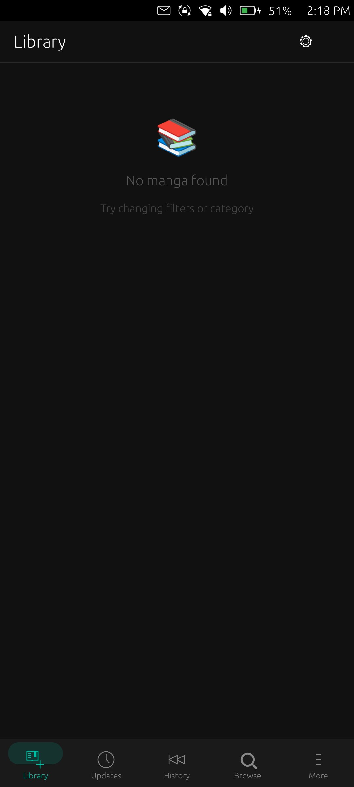
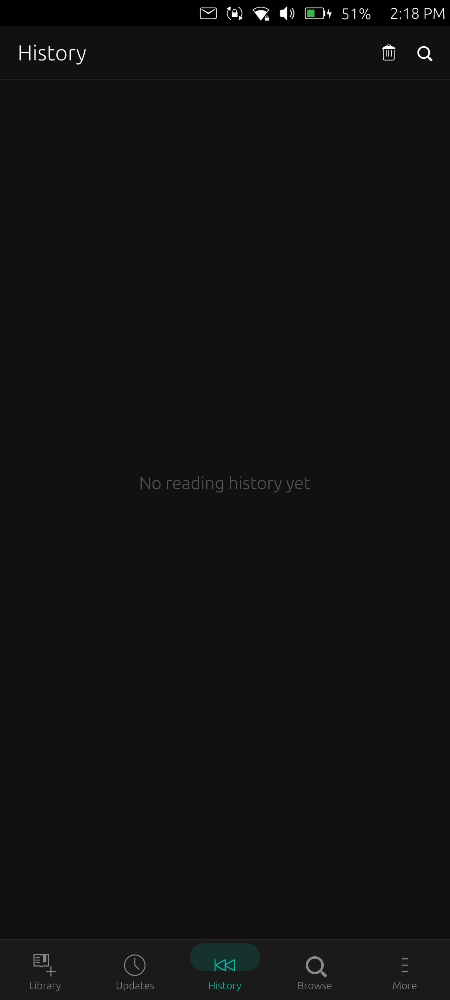
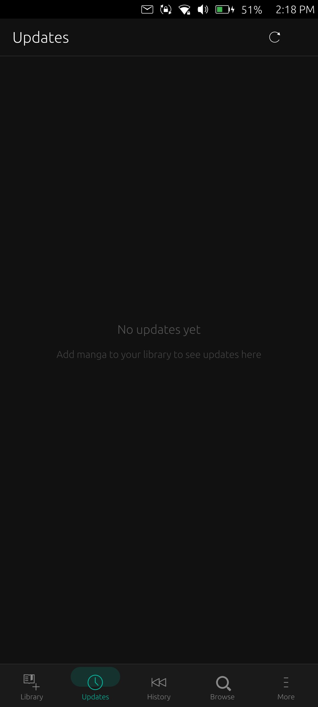
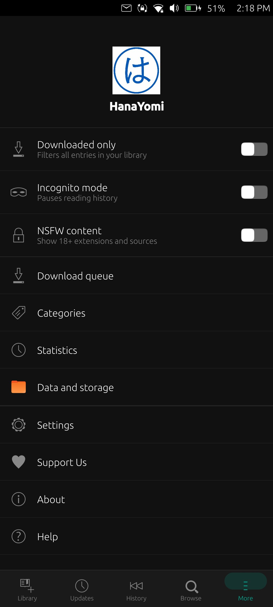
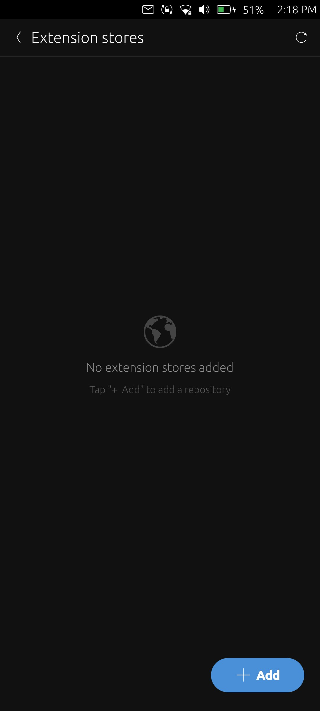

# HanaYomi

<a href="https://open-store.io/app/hanayomi.hakim"></a>

HanaYomi is a beautiful, premium, and native manga reader application designed for **Ubuntu Touch** devices. It is heavily inspired by the desktop/mobile elegance of **Mihon** (and Tachiyomi) and visual styles of **Suwayomi WebUI**. Built on top of C++ and Qt Quick/QML with Lomiri Components 1.3, HanaYomi delivers a fluid, responsive, and teal-accented manga reading experience.

---

## Features

- **Suwayomi-Server Backend Integration**: Employs an embedded **ARM64 Java Runtime Environment (JRE)** directly on the device, allowing it to host a local Suwayomi server backend sandboxed inside the app.
- **Teal Aesthetic Overhaul**: A complete UI refinement matching the sleek dark/cyan tones of Suwayomi WebUI (`#00bfa5` color scheme) across bottom navigation bar, filter chips, lists, badges, and detail views.
- **Dynamic Grid & List Layouts**: Custom rendering options including comfortable grid, compact grid, and list views, which automatically adapt to viewport sizes dynamically.
- **Extension Sync Support**: Browse, install, and synchronize scraping extensions from compatible Keiyoushi indexes directly onto your device.
- **Local Database (SQLite)**: Keeps track of library categories, bookmark states, unread counts, and reading progress locally inside secure AppArmor app-specific directories (`~/.local/share/hanayomi.hakim`).
- **Custom Reader Modes**:
  - **Webtoon Mode**: Smooth, continuous vertical scrolling.
  - **Pager Mode**: Horizontal page-by-page swipe layout with snap transitions.
- **AppArmor Compliant & Sandboxed**: Optimally configured system permissions to allow secure database execution on Ubuntu Touch devices without triggering OS blocks or memory leaks.

---

## Screenshots

<p align="center">
  
  
  
  
  
</p>

---

## Installation

### Prerequisites
To compile and package HanaYomi for Ubuntu Touch, you will need **Clickable** installed on your system.
If you don't have Clickable, install it by following the instructions at [clickable-ut.dev](https://clickable-ut.dev/en/latest/install.html).

### Building & Running on Desktop (Docker Mode)
To build and run the application in a sandboxed Ubuntu Touch environment on your desktop:
```bash
clickable desktop
```
This command automatically pulls the correct Docker builder container, compiles the C++ codebase, and launches the application locally.

### Building & Installing to a Connected Device
To package and install the application directly onto a USB-connected Ubuntu Touch device:
```bash
clickable install --arch arm64
```
This will compile the package specifically for ARM64 architectures, bundle the ARM64 JRE, and push/install the `.click` bundle to your phone.

---

## Usage

1. **Browse & Search**: Go to the **Browse** tab, select an extension (like Komikcast, Shinigami, or WestManga) or add repo stores to browse manga.
2. **Organize**: In the **Manga Detail** page, tap **Add to Library** to save manga into your categories (SQLite Local DB).
3. **Customize Reader**: While reading a chapter, tap the center of the screen to open reader settings. Toggle between **Webtoon** (vertical) and **Pager** (horizontal) modes.
4. **Settings & More**: Manage your database, view statistics, or manage categories in the **More** tab.

---

## Architecture & Code Structure

The project splits performance-critical backend tasks (database operations and API interactions) into C++ classes, exposing them to the QML declarative interface:
- `src/main.cpp`: Entrypoint initializing the QML engine and setting application identifiers matching AppArmor profiles.
- `src/DatabaseHelper.cpp`: Handles all SQLite interactions (history, category configurations, library tables).
- `src/SuwayomiRunner.cpp`: Controls execution, port allocation, and health checks for the local Suwayomi server Java process.
- `src/MangaDexSource.cpp`: Coordinates HTTP requests, QNetworkAccessManager calls, and executes dynamic JavaScript scrapers.
- `qml/Main.qml`: Root application interface and bottom navigation bar.
- `qml/pages/`: Contains page files (`LibraryPage.qml`, `ReaderPage.qml`, `MangaDetailPage.qml`, `BrowsePage.qml`, `MorePage.qml`, etc.).

---

## License

HanaYomi is licensed under the Apache License 2.0. See the `LICENSE` file for details.